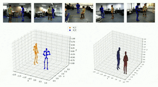

# Smpl-Vae
Based on in-body 2D pose point detection of MVSPIN, real 3D pose points are obtained through clustering algorithm and real camera matrix. With reference to Vae, a SMPL-VAE human regression model combining step training and joint training is proposed. The model corrects Smpl modeling results according to Vae training results. While maintaining the overall proportion, it is more in line with the local modeling of human motion structure.

## Environment
Ubuntu 18.04  
Python 3.7.4  
cuda 11.1  
cudnn 8.0.5  
Pytorch 1.10.0 + cu111

## Dataset
Download dataset `gt` from: https://pan.baidu.com/s/1MSDj2DHkTy669yOGLmKUEg. code: 6666.     
Save them in `gt`

Download `basicModel_neutral_lbs_10_207_0_v1.0.0.pkl` from: https://pan.baidu.com/s/1MSDj2DHkTy669yOGLmKUEg. code: 6666.   
Save `basicModel_neutral_lbs_10_207_0_v1.0.0.pkl` in `smplpytorch/native/models`  

## Run
run example `main.py`  

## Qualitative Results

Our work has achieved satisfactory results in pedestrian detection and modeling
  

## Quantitative Results
**MPJPE** - Mean Per Joint Position Error
**PCK** - Percentage of Correct Keypoints

|    method     | MPJPE  |  PCK  |
| :---------: | :---------: | :---------: |
|   SMPLify   | 109.30 | 88.76 |
|     HMR     | 114.62 | 83.26 |
| Shape-aware | 105.62 | 85.35 |
|   Ours    | 101.74 | 92.26 |
